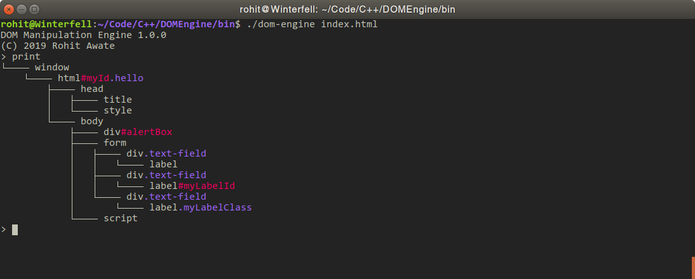

# DOM Manipulation Engine
A simple command-line program for parsing HTML files and building a DOM tree which can then be accessed and manipulated from an interactive shell using jQuery-like selectors and commands.

This is an nothing more than an effort at learning modern, idiomatic C++ and understanding the working of web browsers. Its intriguing at best and useless at worst. Have fun with it!



## Building from source
You'll need the following installed:
- A compiler which supports at least C++11: `g++`, `clang++` or `Visual C++`
- `CMake`
- `make`
- `git`

#### Steps
```bash
# Clone the repository
git clone https://github.com/RohitAwate/DOMEngine

# Open the directory
cd DOMEngine/

# Create a new directory and open it
mkdir build/ && cd build/

# Generate the build files
cmake .. -DCMAKE_BUILD_TYPE=Release

# Build the project
make

# Open the bin/ folder
cd ../bin/

# Run DOM Engine
./dom-engine <html-file>
```

## Commands

- `print`
    Prints out the DOM tree.
- `$("#someId.firstClass.secondClass")`
    _(Work in progress)_ Finds a DOM element with ID `someId` and classes `firstClass` and `secondClass`.
- `exit`
    Exits the shell.

## License
MIT
    